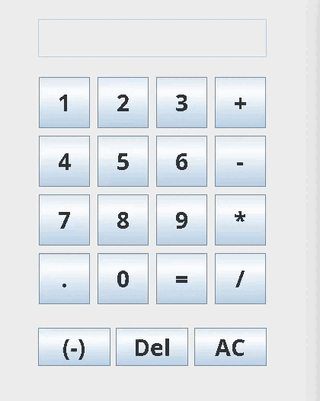
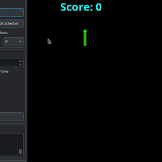
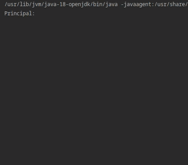
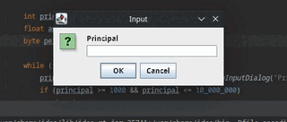
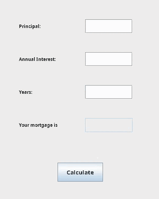

# Welcome to my Java practice projects

Hi! My name is Phone Myint Maw and these files include my **Java projects** based on the tutorials found online. These are not the exact same projects found on these tutorials because I combined a lot of things I learned throughout the self-learning phase. If there are like-minded people like me in these ideas, I hope to be able to help a little by these projects. Cheers!

## Files
- Calculator
- Snake Game
- Mortgage Calculator with command line
- Mortgage Calculator with JOptionPane
- Mortgage Calculator with GUI

## Screenshots
Calculator |  Snake Game
:------------------:|:-------------------
 | 
Mortgage Calculator |  Mortgage Calculator with JOptionPane
:------------------:|:-------------------
 | Mortgage Calculator with GUI
:------------------:|

## Requirements
- Java 8 or higher

## Installation
1. Press the **Fork** button (top right the page) to save copy of this project on your account.

2. Download the repository files (project) from the download section or clone this project by typing in the bash the following command:

       git clone https://github.com/meemaw2020/Java-Projects.git
3. Imported it in Intellij IDEA or any other Java IDE.
4. Run the application

## Contributing
If you want to contribute to this project and make it better with new ideas, your pull request is very welcomed.
If you find any issue just put it in the repository issue section, thank you.

## Thank you
If you find these projects helpful, don't forget to share with others and give it a star.

